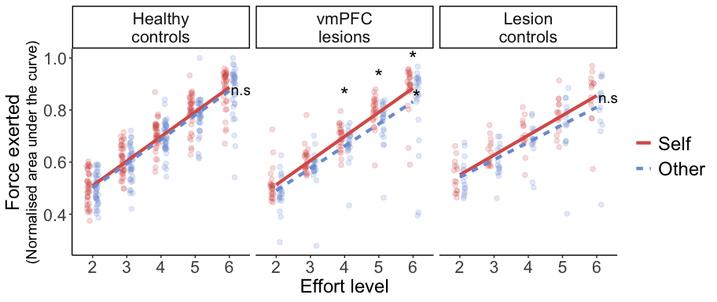
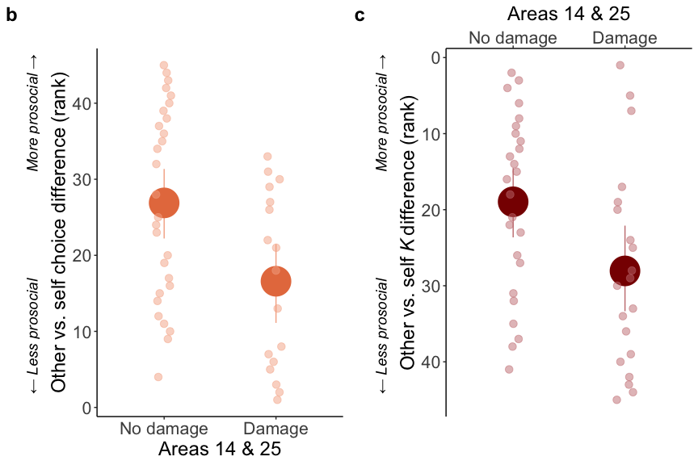
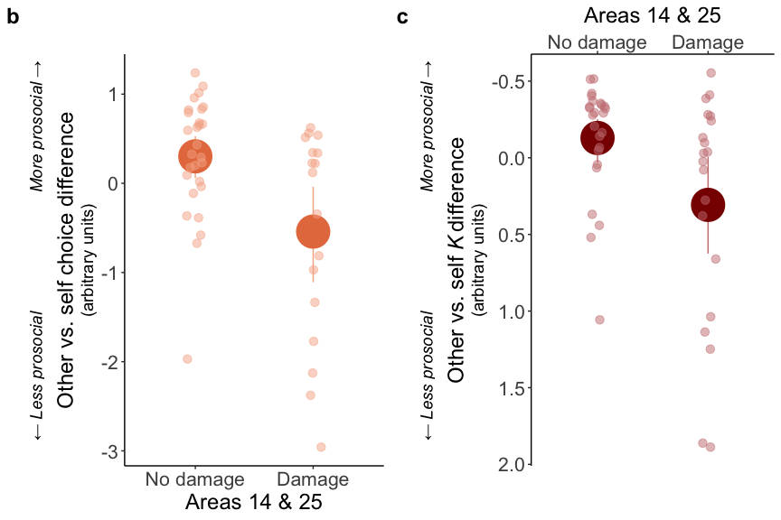
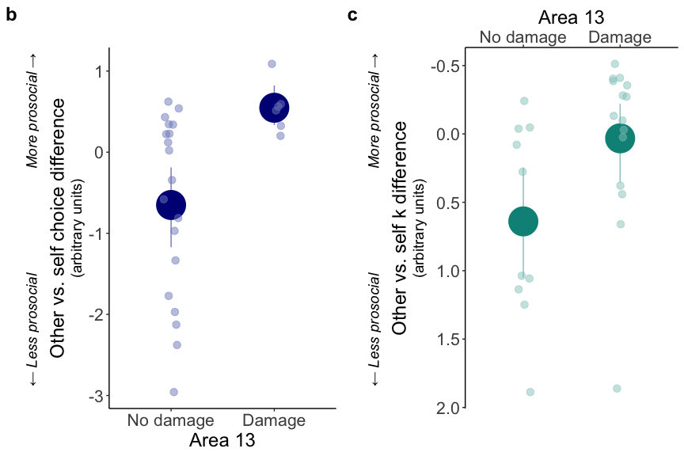
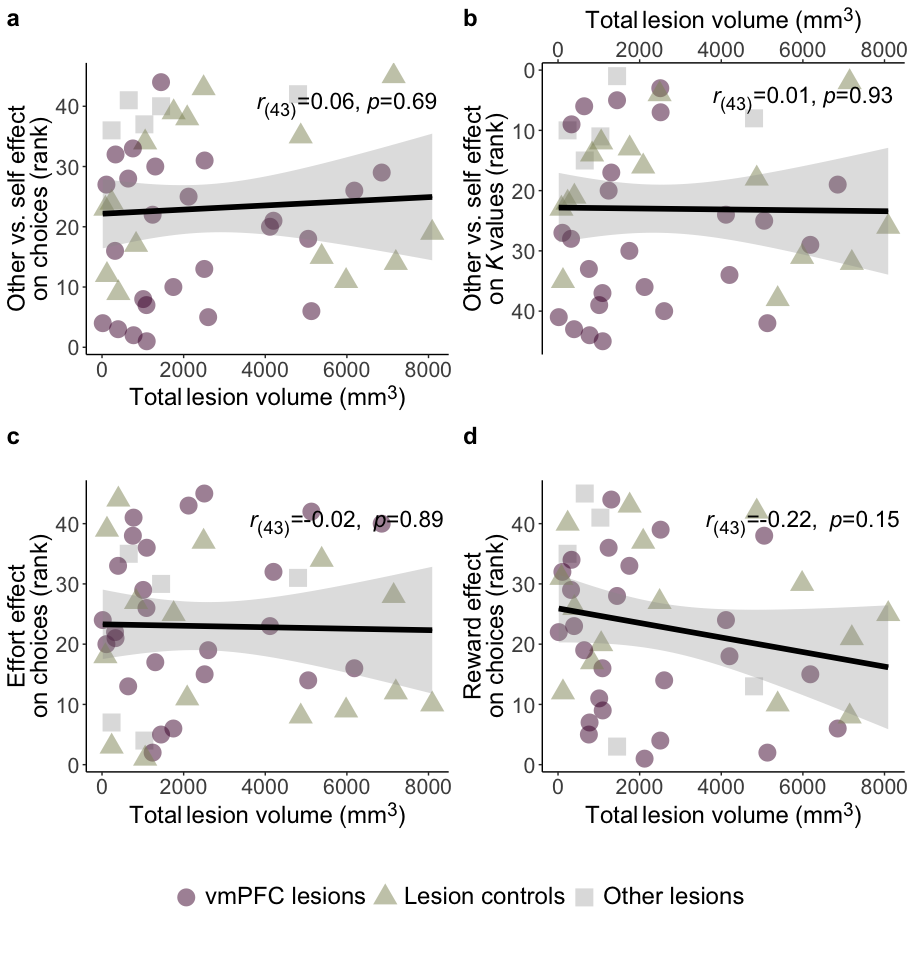

# Analysis

## Set up and functions

## Analyse credits earned

### Models of credits

### Post-hoc tests on credits

### Bayesian tests on credits

### Plot credits

## Analyse choice data

### Format results

### Post-hoc tests on choice data

### Bayesian tests on choices

### Plot choice data

## Computational modelling results

### Plot model comparison

### Plots of model identifiability, parameter recovery & model fit

## Analyse <i>Κ</i> parameters

### Models of <i>Κ</i> parameters

### Post-hoc tests on <i>β</i> parameters

### Bayesian tests on <i>Κ</i> parameters

### Plot <i>Κ</i> parameters

## Analyse <i>β</i> parameters

### Models of <i>β</i> parameters

### Bayesian tests on <i>β</i> parameters

### Plot <i>β</i> parameters

## Analyse force data

### Models of success rates

### Post-hoc tests on success rates

### LLM of force data

### Format results

### Post-hoc tests on force data

### Plot force data

## Lesion mapping

### Plot lesion size correlations (all patients)

### Plot lesion mapping - all patients

### Plot lesion mapping - vmpfc only

# Manuscript

## Methods

### *Participants*

We recruited three groups of participants, one with focal damage to vmPFC and one with lesions elsewhere, 
from a database of 453 neurological patients, as well as healthy age and gender-matched controls from university databases and the community. 
The vmPFC lesion group included 
25 patients
with vmPFC damage (age
range=37-76,
mean=56.44;
14 females). 
Two other patients with vmPFC lesions took part but were excluded from 
all analyses for not following the task instructions or not understanding the task. 
The lesion control (LC) group included 
15 patients with
lesions in areas outside vmPFC (age
range=28-74,
mean=56.00;
10 females). 
The healthy control (HC) group included 
40 
participants with no brain damage (age
range=36-67,
mean=60.00;
23 females), 
giving a total sample of 
n=80 
for group-based analyses. Finally,
five
additional patients with lesions affecting more dorsal regions of mPFC
or the anterior cingulate cortex (ACC) also completed the task (age
range=49-66,
mean=57.40;
2 females). 
These patients were only included in the lesion mapping analysis (see below), 
which had a total sample of 45 patients. We did not include patients with dorsal mPFC or 
ACC lesions in the between-group analyses, as the damage was not within the vmPFC region 
of interest, but also was not distinct enough to include in the lesion control group.
Classification of lesion location was done from MR imaging or CT scans 
(see below) by a neurologist (SGM).

Across the vmPFC and LC groups, most lesions were caused by subarachnoid haemorrhage. 
Three patients’ damage was caused by tumour (2 vmPFC, 1 LC) and one LC patient by head injury. 
In all cases, the brain damage occurred at least 24 months prior to testing. 15 out of 45 patients 
were hypertensive (10 vmPFC, 5 LC), four were on antidepressants (1 vmPFC, 3 LC), and 2 took pregabalin (1 vmPFC, 1 LC). 
We carefully screened participants and recruited them such that there were no differences between groups in terms of gender 
(<i>χ</i>2(3)=
1.17,
*p*=0.76), age 
(*p*s>0.19),
self-reported levels of apathy (Apathy Motivation Index[REF]; 
*p*s>0.14), or performance on a neuropsychological test of cognitive abilities and visual attention (Trail Making Test[REF]; Part A 
*p*s>0.20, Part B 
*p*s>0.37).

The vmPFC group also did not differ from controls in 
depression (Beck Depression Inventory[REF]; 
*p*s>0.11)

## Results

To establish the impact of vmPFC damage on prosocial behaviour, effort, and reward processing, we compared 
25 patients with vmPFC damage 
(mean age=56.44;
14 females) to two control groups. 
15 lesion control (LC) patients had damage to areas outside vmPFC 
(mean age=56.00;
10 females), and 
40 healthy control (HC) participants did not have any brain damage 
(mean age=60.00;
23 females). 
All participants completed an effort-based decision-making task[REF], 
that independently manipulated effort, reward, and recipient. 
Participants chose between a low-effort, low-reward “rest” option and a 
high-effort high-reward “work” option on each trial. On half of the trials, the reward was for themselves 
(self) and on the other half, the reward was for an anonymous other person (other; see Methods and Figure 2). 
The groups were carefully matched, with no differences in gender, age, cognitive ability, or levels of apathy 
or depression (See Methods and Table S1).  

gender
(<i>χ</i>2(3)=
1.17,
*p*=0.76) or age
(*p*s>0.19). 
The vmPFC group also did not differ from the control groups in self-reported levels of apathy (Apathy Motivation Index[REF]; 
*p*s>0.14),
depression (Beck Depression Inventory[REF]; 
*p*s>0.04)
or performance on a neuropsychological test of cognitive abilities and visual attention (Trail Making Test[REF]; Part A 
*p*s>Inf, Part B 
*p*s>Inf).

### *Patients with vmPFC damage earn less money for the other person*

Our first analysis examined how many credits participants earned for themselves and the other anonymous participant, 
which translated into bonus money for each recipient. We tested whether the number of credits earned differed between 
the three groups (vmPFC, HC, LC) using a generalised linear mixed-effects model (GLMM, see Methods and Table S2). 
Patients with vmPFC damage earned fewer credits for other relative to self, compared to both control groups
(group\*recipient interaction vmPFC vs. HC
b [95% confidence interval]=0.88
[0.81,
0.95],
*p*=0.003;
vmPFC vs. LC
b=0.87
[0.78,
0.97],
*p*=0.010; Figure 3A). 
Post-hoc tests revealed that these interactions were driven by the vmPFC group earning significantly fewer credits for the other person, 
compared to both healthy controls 
(ratio=0.73,
SE=0.07,
Z=-3.13,
*p*=0.002) 
and patients with damage elsewhere (ratio=0.76,
SE=0.10,
Z=-2.18,
*p*=0.030; Table S2). 

In contrast, vmPFC patients earned the same amount as lesion controls for themselves 
(ratio=1.00, 
*p*=0.99, 
Bayes factor (BF01)=3.05; see Methods)
and did not significantly differ from healthy controls
ratio=0.95, 
*p*=0.59, 
BF01=2.10). 
The two control groups did not significantly differ in the number of credits earned for either recipient 
(other ratio=1.04,
SE=0.12,
Z=0.31,
*p*=0.75, 
BF01=3.17;
self ratio=1.06,
SE=0.13,
Z=0.47,
*p*=0.64, 
BF01=2.87).
Together, these results show that damage, specifically to vmPFC, decreased rewards earned for the other person, 
but not the participant themselves.

#### Figure 2

<!-- -->
**Figure 2. Effort-based decision-making task with rewards for self or other. (a)** Before any further instructions, participants squeezed as hard as they could to measure their maximum voluntary contraction (MVC) on a handheld dynamometer to threshold each effort level to their strength. After thresholding and practice, participants chose on each trial between a “rest” option, which required no effort (0% MVC, one segment of the pie chart) for a low reward of 1 credit, and a “work” option, which required more effort (30%–70% MVC, 2–6 pie chart segments) and gained more reward (2–10 credits). The reward available and effort required were manipulated independently. After making their choice, participants had to exert the required force (shown by the yellow line) for at least 1s of a 3s window to receive the reward. Visual feedback on the amount of force used was displayed on the screen. Participants then saw the outcome, depending on the offer they had chosen and whether they were successful. If they did not meet the required force level, “0 credits” was displayed. Crucially, on self-trials, participants made the choice, exerted the effort, and received the reward themselves, whereas on other trials (“AMY” in this example), participants made the choice and exerted the effort, but the other participant received the reward. **(b)** Participants were designated as “Player 1” (self) and told that their decisions impacted another player “Player 2” (other) whom they met at the beginning of the testing session with their identity obscured (to control for influences of identity or reciprocity). The name used in the task was gender-matched to the participant. The procedure involved 4 people, two experimenters, EXP1 and EXP2, and two participants, self and other.

### *Damage to vmPFC decreases prosocial behaviour*

To examine what was driving the group difference in the broad measure of credits earned, 
we first considered participants’ willingness to choose the high-effort option over rest. 
Using a binomial GLMM (see Methods), we tested whether vmPFC lesions affected prosociality 
(recipient\*group interaction) in choices. 
Analysing choices on each trial also enabled us to test group differences in sensitivity to rewards (reward level 2-6: 2, 4, 6, 8 or 10 credits) and effort (effort level 2-6: 30, 40, 50, 60 or 70% of maximum, squared to match computational model; see Methods). We also considered the possibility of higher-order interactions by starting with a maximal model containing fixed effects of and all interactions (up to 4-way) between effort, reward, recipient, and group, as well as random effects and all interactions (up to 3-way) between effort, reward, and recipient. Data-driven model reduction suggested that no interaction terms between more than two variables significantly improved the model (see Methods).

Prosociality decreased with vmPFC damage (Table S3). vmPFC patients chose to work to benefit the other person less than both control groups
(vmPFC vs. HC OR=0.33,
SE=0.17,
Z=-2.11,
*p*=0.034; vmPFC vs. LC
OR=0.23,
SE=0.15,
Z=-2.19,
*p*=0.029). 
In contrast, the vmPFC group was equally willing to exert effort to benefit themselves compared to both control groups 
(vmPFC vs. HC OR=0.91,
SE=0.51,
Z=-0.17,
*p*=0.87, 
BF01=3.57; vmPFC vs. LC
OR=1.01,
SE=0.72,
Z=0.01,
*p*=0.99, 
BF01=3.13).
Finally, the two control groups did not significantly differ in willingness to exert effort for self or other, 
although these contrasts were not sensitive enough to support evidence of no difference 
(self OR=1.11,
SE=0.73,
Z=0.16,
*p*=0.88,
BF01=2.95; 
other OR=0.70,
SE=0.43,
Z=-0.58,
*p*=0.56,
BF01=2.56).

#### Figure 3

<!-- -->
 
**Figure 3. Damage to vmPFC decreases prosociality and effort sensitivity.** 
vmPFC lesions decreased willingness to help others measured as 
**(a)** earning fewer credits for the other player, 
but not for themselves, **(b)** 
accepting fewer high-effort high-reward “work” offers for other, but not themselves. 
Asterisks between groups represent significant interactions between the recipient 
(self or other) and group in the (G)LMM. Asterisks between self and other represent 
significant differences (p<0.05) within each group in post-hoc comparisons. Significance 
for comparisons between groups for each recipient are not depicted but show the significant 
recipient\*group interactions are driven by vmPFC patients earning significantly fewer credits 
and accepting significantly fewer work offers for the other person, compared to both control groups
(*p*s<0.03; see Results).
In contrast, there were no significant differences between vmPFC patients 
and the control groups in self-benefitting decision-making 
(*p*s>0.94) and 
there was Bayesian evidence of no difference between groups in credits earned (vs. LC) and choices to work for self-benefitting rewards
3.05<BF01<3.57.
**(c)** The effect of effort on decision-making differed between vmPFC patients and participants 
without brain damage (estimates from generalised linear mixed-effects model (GLMM) of binary choices between work and rest; group\*effort interaction 
OR=0.44
[0.28,
0.69],
*p*<0.001).
This group difference in effort sensitivity was driven by vmPFC patients’ reduced willingness to accept the work offer at the 
lower effort levels compared to healthy controls. Asterisks represent significant differences (*p*<0.05) in post-hoc comparisons 
at each effort level. **(d)** In contrast, there were no significant group differences in how reward affected decisions. 
All three groups were more willing to exert effort as the reward available increased, and there was no evidence that this 
sensitivity to reward was significantly different in the vmPFC group.

higher discounting of rewards by
effort (<i>Κ</i>) for other relative to self.
Asterisks between groups represent significant interactions (*p*\<0.05) between recipient 
(self or other) and group in the (G)LMM. 
Asterisks between self and other represent significant differences (*p*\<0.05) in post-hoc
comparisons based on (G)LMMs with the relevant link function for the
data distribution (gamma for credits, binomial for choices, log for <i>Κ</i>). 
Results of post-hoc comparisons between groups for each recipient are not depicted but showed 
the significant recipient\*group interactions are driven by vmPFC patients earning significantly 
fewer credits and accepting significantly fewer work offers for the other person, compared to both control groups 
(*p*s<0.03; 
Table S2, Table S4 & Table S6). In contrast, there were no significant differences between vmPFC patients 
and the control groups in self-benefitting decision-making for credits, 
choices or <i>Κ</i> parameters
(*p*s>0.94) and 
there was Bayesian evidence of no difference between groups in credits earned and choices to work for self-benefitting rewards.

### *vmPFC lesions alter effort sensitivity*

Analysis of sensitivity to effort also revealed a significant difference between healthy controls and vmPFC patients 
(group\*effort interaction OR=0.44
[0.28,
0.69],
*p*<0.001; Figure 3C).
Healthy control participants accepted a high
number of work offers at the lower effort levels (level 2 
mean=0.92),
but willingness to work dropped dramatically when more effort was required (level 6 
mean=0.64).
This meant higher effort had a large negative effect on choices for healthy controls (effort effect 
[confidence level]=-1.73
[-2.00,
-1.00]).
In contrast, while vmPFC patients were also less willing to work when more effort was required, 
the effect of effort on choices was significantly less negative 
(effect=-0.91
[-1.32,
-0.51]).
This group difference in how effort affected choices was due to vmPFC patients accepting relatively fewer 
work offers than healthy controls when the effort required was minimal (level 2 
mean=0.81),
but a similar willingness to work at the highest effort level (level 6
mean=0.63; Figure 3C).
Follow-up analyses showed reduced effort sensitivity in vmPFC patients compared to healthy controls for both recipients 
(self OR=0.48
[0.29,
0.78],
*p*=0.003;
other OR=0.42
[0.26,
0.68],
*p*<0.001).
Effort also negatively affected lesion control patients’ willingness to work, but this did not significantly differ from the other groups (LC vs. vmPFC GLMM
group\*effort interaction OR=0.73
[0.42,
1.27],
*p*=0.27; LC vs. HC post-hoc 
interaction=-0.50,
SE=0.27,
Z=-1.87,
*p*=0.061).

Analysis of sensitivity to reward showed participants in all three groups chose to work more when a larger reward was available 
(vmPFC GLMM OR=6.91
[4.70,
10.15],
*p*<0.001; Figure 3D).
Across groups, we observed that people were more likely to choose the higher effort option as reward increased, 
and when the reward was for themselves compared to another person (recipient\*reward interaction
OR=1.71
[1.46,
2.01],
*p*<0.001).
However, of group differences in reward processing (Figure 3D). The group\*reward interaction was not selected as a term in 
the GLMM and there was strong evidence against adding it to the best-fitting model 
(Δ deviance 
<i>χ</i>2(2)=2.74,
*p*=0.25,
Δ BIC=15.98, BF01=2950.76).

As expected, the GLMM of choices also showed participants overall chose to work more when
rewards were for themselves, compared to someone else
(OR=5.73
[3.77,
8.70],
*p*<0.001), 
also showed that the increase in willingness to work as the reward available
increased was larger when the reward was for themselves (effect of reward for
self=2.47
[2.01,
2.93]),
compared to someone else (effect of reward for
other=1.39
[1.02,
1.76]). 

### *Reward devaluation by effort depends on recipient*

So far, we have shown vmPFC damage has a detrimental impact on prosocial decision-making, and that this is at least partially due to vmPFC patients’ lower willingness to exert effort for prosocial rewards, compared to both control groups. Next, we fitted computational models of effort-discounting to participants’ choice behaviour to precisely quantify how the effort required was integrated with the reward available to determine choices for self or other. Importantly, these models separate the extent to which effort devalues the reward (discounting <i>Κ</i> parameter) 
from choice consistency (stochasticity <i>β</i> (beta) parameter) and therefore allow us to test which of these parameters differ 
between recipients and groups.

We fit and compared multiple models to participants' 
choice behaviour using a hierarchical expectation maximisation approach... [paragraph only in word doc for refs]. 
We also established the robustness of our winning model and model
comparison procedure using simulated data. These simulations showed good
recovery of all parameters
(<i>Κ</i>self=0.87,
<i>Κ</i>other=0.87,
<i>β</i>self=0.86,
<i>β</i>other=0.86)
and that the models were identifiable (see Supplementary Methods and
Figure 4).

#### Figure 4

<!-- -->
**Figure 4. A computational neurology approach reveals vmPFC damage increases discounting of rewards for other by effort. (a)** 
Results of model identifiability analysis show a strong diagonal across the majority of the average exceedance probability confusion matrix, meaning the models of interest can be accurately identified. We simulated ten datasets each with 100 artificial agents, using each of the 12 models. Parameters were drawn at random from a flat distribution between the upper and lower bounds used when fitting the model to participant data 
(0<<i>Κ</i><1.5, 0<i>β</i><4). We then fit each dataset using the same model fitting and comparison procedure applied to participant data and plotted the confusion matrix from the exceedance probability averaged across the ten runs. **(b)** Model comparison of the 12 candidate models shows the 2<i>Κ</i>2<i>β</i> parabolic model best fits the participant data based on multiple fit metrics. This model had a parabolic discounting function and contained separate discounting and choice stochasticity parameters for self and other. It had the highest exceedance probability (XP=1), lowest integrated BIC, and explained the highest proportion of variance in choices (R2=0.87). **(c)** Strong parameter recovery for the 2<i>Κ</i>2<i>β</i> is shown by the high correlations on the diagonal between simulated and recovered parameter values and low off-diagonal correlations. Simulations for parameter recovery used a grid of values for <i>Κ</i> (0, 0.3, 0.6, 0.9, 1.2, 1.5) and <i>β</i> (0, 1, 2, 3, 4), with added noise drawn from a normal distribution * 0.05, to cover the full range of possible values. **(d)** Comparing discounting <i>Κ</i> parameters
from the winning model between recipients and groups shows vmPFC damage increases discounting of prosocial rewards. Asterisks between groups represent significant interactions between the recipient (self or other) and group in the (G)LMM. Asterisks between self and other represent significant differences (*p*<0.05) within each group in post-hoc comparisons. 

### *vmPFC lesions increase the discounting of prosocial rewards by effort*

After establishing the 2<i>Κ</i>2<i>β</i> model
was robust and best fit the data, we assessed whether the estimated
<i>Κ</i> parameters differed between the three groups and two recipients 
using a  GLMM. All groups showed higher effort discounting of rewards for other compared to self (Figure
3, Table S1 and Table S2) indicating that the
bias towards helping oneself, reported previously, occurs regardless of
lesion location. However, as with the analysis of credits earned and choices to work, 
damage to vmPFC specifically decreased prosociality on this measure. 
The effort required to obtain rewards devalued prosocial rewards to a greater extent 
than self-benefitting rewards for the patients with vmPFC damage, 
compared to both control participants with lesions
elsewhere (group\*recipient interaction 
b=1.46
[1.15,
1.85],
*p*=0.002)
and participants without lesions
(b=1.36
[1.12,
1.65],
*p*=0.002; 
Figure 2 and Table S2). Post-hoc and Bayesian contrasts comparing patients with vmPFC to control lesions
showed effort discounting for self was the same regardless of lesion location 
(ratio=1.02,
SE=0.34,
Z=0.07,
*p*=0.94,
BF01=3.16), 
whereas damage to vmPFC specifically increased how much rewards for another person were discounted by the effort required 
(ratio=2.18,
SE=0.73,
Z=2.31,
*p*=0.021). 
Comparing vmPFC patients with healthy controls showed this significant group\*recipient interaction was also driven by vmPFC patients discounting 
rewards for other relative to self more than healthy controls (Figure 2), although comparing each recipient separately between these groups 
did not show either significant differences or evidence of no difference 
(self ratio=0.88,
SE=0.23,
Z=-0.50,
*p*=0.62,
BF01=2.01; 
other ratio=1.62,
SE=0.43,
Z=1.83,
*p*=0.067, 
BF01=0.88). 
The two control groups also did not significantly differ in discounting for self or other, but these contrasts 
also lacked the sensitivity to support evidence of no difference 
(self ratio=1.17,
SE=0.36,
Z=0.50,
*p*=0.62,
BF01=2.05; 
other ratio=1.34,
SE=0.42,
Z=0.95,
*p*=0.34, 
BF01=1.38). 

Prosociality did not differ between the control groups (post-hoc group\*recipient 
interaction=0.87,
SE=0.19,
Z=-0.65,
*p*=0.52

We used the same approach to examine whether vmPFC damage results
in differences in decision noise (stochasticity <i>β</i>
parameter) in an LMM. Across all groups, participants made noisier decisions in 
the prosocial compared to the self-benefiting condition 
(*p*s=Inf; Figure S1, Table S3 & Table S4). 
In other words, when choosing whether to work to gain rewards for
someone else, participants choices less closely followed the relative
value of working compared to resting. However, unlike the
<i>Κ</i> parameters, there was no evidence this self-other
difference in <i>β</i> parameters was significantly affected by vmPFC
damage (LMM group\*recipient interactions 
*p*s>0.179). 
Overall levels of decision noise, across the prosocial and
self-benefiting conditions, also did not significantly differ between
the groups (Table S4).

### *Patients with vmPFC damage exert less force to help another person*

Decreased prosocial choices and increased effort discounting of prosocial rewards 
in vmPFC patients at least partially explain why this group earned less credits for the other person 
than both control groups. Our final behavioural analysis considered how much force participants 
exerted after choosing the work option. This could also contribute to reduced prosocial outcomes overall as 
participants earn no credits on trials they choose to work but then do not exert enough force (unsuccessful trials). 
Analysing force within successful trials also provides a complementary measure to choices and discounting that 
captures how much participants energise actions that benefit themselves and others.
As with the choice data, we modelled force (normalised area under the
curve, see Methods) by reducing a maximal LMM that contained fixed
effects of and all interactions (up to 4-way) between effort, reward,
recipient and group, as well as random effects and all interactions (up
to 3-way) between effort, reward and recipient. Here, we focus on interaction 
terms that include group to examine differences between the groups
(see Table S7 for full results).

Patients with vmPFC damage exerted less force for other relative to self
compared to healthy controls (group\*recipient interaction
b=-0.092
[-0.178,
-0.006],
*p*=0.036), 
particularly at higher effort levels (group\*recipient\*effort
interaction
b=-0.027
[-0.052,
-0.002],
*p*=0.037) 
and when the reward available was lower
(group\*recipient\*effort\*reward interaction
b=0.052
[0.028,
0.076],
*p*<0.001;
Figure 4). This sensitivity to effort and reward in determining the
force exerted when rewards were for another person is evidence against
the idea that vmPFC damage meant patients were not attending to the details
of the work offer in the prosocial condition. 
Interestingly, in a second analysis, limited to trials on which the participant successfully
exerted at least the required level of force,
there was no evidence that any of these interactions improved the model
fit and they did not feature in the best model (Table S8). This suggests that 
patients with vmPFC damage sometimes under-exerted force after 
deciding to help the other person, particularly at high effort and low reward levels, 
and therefore did not always exert enough force to obtain the prosocial reward, a pattern we
previously termed 'superficial prosociality'. High average success rates across trials in 
all three groups demonstrates that superficial prosociality among vmPFC patients was 
not due to issues accurately exerting the required force overall 
(vmPFC mean=%, 
HC mean=%, 
LC mean=%).
When contrasting patients with damage to vmPFC to patients
with damage elsewhere, the only significant interaction was with effort, in 
the analysis limited to successful trials
(b=-0.174
[-0.284,
-0.063],
*p*=0.002).
However, lesion control patients also differed from healthy controls in this analysis 
(post-hoc group\*effort interaction=0.03,
SE=0.01,
Z=3.11,
*p*=0.002), whereas healthy 
controls and vmPFC patients did not significantly differ 
(LMM group\*effort interaction b=0.042
[-0.044,
0.129],
*p*=0.34). 
As patients in the lesion control group had damage to
a wide range of brain areas, we do not further interpret this result.

Interestingly, results revealed that patients with vmPFC successfully exerted the required effort more often for self 
(95.05%
success rate) 
than other 
(87.29%; 
contrast=0.08,
SE=0.02,
t=3.17,
*p*=0.002). 
In contrast, healthy control participants had similar success rates for self 
(97.57%) 
and other 
(96.91%; 
contrast=0.01,
SE=0.02,
t=0.35,
*p*=0.73,
BF01=2.95; 
LMM group\*recipient interaction
b=-0.319
[-0.592,
-0.045],
*p*=0.023). 

#### Figure 5
<!-- -->
 
**Figure 5. Patients with vmPFC lesions exert less force for other relative to self, particularly when a large amount of effort is required.** 
Patients with vmPFC damage exerted less force to obtain reward for the other person than themselves (post-hoc 
contrast=0.04,
SE=0.01,
Z=3.62,
*p*<0.001), 
whereas this was not the case for healthy control participants (post-hoc 
contrast=0.01,
SE=0.01,
Z=1.32,
*p*=0.19;
LMM group\*recipient interaction 
b=-0.09
[-0.18,
-0.01],
*p*=0.036).
This group difference in energising actions to benefit other, relative to self, 
was particularly large when the level of effort required was greatest (LMM group\*recipient\*effort interaction 
b=-0.03
[-0.05,
0.00],
*p*=0.037) 
and also when the reward available was smallest (LMM group\*recipient\*effort\*reward interaction 
b=0.05
[0.03,
0.08],
*p*<0.001;
Figure S2 & Table S7).

In summary, multiple behavioural measures and computational parameters 
showed damage to vmPFC specifically reduced willingness to exert effort to help 
another person, compared to controls both with and without lesions. These
differences in prosociality were found in the absence of group
differences in choices, discounting, or force exerted for
oneself. Patients with vmPFC damage also did not show differences in
reward sensitivity but how effort affect choices was altered compared to
healthy controls.

### *Damage to medial vmPFC is associated with decreased willingness to help others whereas lateral vmPFC damage increases prosociality*

[Lesion mapping results]

#### Figure 6
[With brains]
<!-- --><!-- -->

#### Figure 7
[With brains]
<!-- --><!-- -->

#### Figure 8
[Just brains for reward effects]

# Supplement

#### Figure S1

<!-- -->
 
**Figure S1. Choice consistency is higher for self than other but no significant effect of vmPFC damage.** Analysis of choice stochasticity <i>β</i> parameters revealed choices in all three groups more consistently followed the relative subjective value between options. However, there were no significant differences between groups in choice consistency overall and importantly no significant interactions between group and recipient in predicting <i>β</i> parameters (Table S7 & Table S8).

#### Figure S2

<!-- -->
 
**Figure S2. vmPFC damage decreases the force exerted to gain rewards for another person, compared to oneself, as the effort required increases, particularly for the smallest rewards.** In addition to the group\*recipient and group\*recipient\*effort interactions shown in Figure 5, the linear mixed-effects model of force exerted showed a significant 4-way group\*recipient\*effort\*reward interaction 
(b=0.05
[0.03,
0.08],
*p*<0.001; Table S9 & S10). This sensitivity to the reward available and effort required, combined with high overall success rates, suggests vmPFC patients' reduced willingness to exert force for prosocial rewards was not due to an inability to meet the required force or attend to the information in the trial.

#### Figure S3

<!-- -->
**Figure S3. No significant correlations between total lesion size and the behavioural predictors for VLSM.** As a control analysis to support the voxel-based lesion symptom mapping (VLSM), we correlated total lesion volume with each of the four behavioural predictors, calculated as the (ranked) participant-level random effects from the generalised linear mixed-effects models of choices and <i>Κ</i> parameters (effect of recipient on choices, effect of reward on choices, effect of effort on choices, effect of recipient on <i>Κ</i> parameters). The lack of significant correlations in all cases suggests that overall lesion size did not confound the VLSM analysis and results are specific to damage in each of the identified subregions.

#### Figure S4

<!-- -->
**Figure S4. Damage to medial vmPFC regions decreases willingness to exert effort for others and increases willingness to obtain self-benefitting rewards.** To further interpret the voxel-based lesion symptom mapping (VLSM) finding of decreased prosociality with damage to portions of vmPFC on the medial wall (area 14m and 32), we plotted each recipient separately to examine how damage affects **(a)** choices for other **(b)** choices for self **(c)** discounting *Κ* parameters for other and **(d)** discounting <i>Κ</i> parameters for self. We categorised participants by whether they had damage or not in the areas identified in the VLSM analysis for each effect (choices and <i>Κ</i>; see Figure 6A). These plots suggest that decreased prosociality shown by the recipient effects (other vs. self) in the VLSM are driven by both lower willingness to help the other person and higher willingness to work for oneself in patients with damage to these regions.

#### Figure S5

<!-- -->
**Figure S5. Damage to lateral vmPFC increases willingness to help others and decreases willingness to exert effort for oneself.** Our voxel-based lesion symptom mapping (VLSM) analysis identified a lateral portion of vmPFC in area 13a/b where damage was paradoxically associated with increased prosociality. To further interpret this finding, we extracted the extent of damage for each participant in the region identified in the VLSM analysis of the recipient effect (other vs. self) on *Κ* parameter. The corresponding effect on choices was associated with a smaller, overlapping region of area 13a/b (see Figure 7). Plotting damage in this region against **(a)** discounting *Κ* parameter for other and **(b)** discounting *Κ* parameter for self separately shows the increase in relative prosociality is driven by both lower discounting (higher willingness to work) for other and higher discounting (lower willingness to work) to some extent for self.

#### Table S0 (new S1)

<table class="table" style="margin-left: auto; margin-right: auto;">
<caption>Summary of demographic variables for each group</caption>
 <thead>
  <tr>
   <th style="text-align:left;"> measure </th>
   <th style="text-align:center;"> HC </th>
   <th style="text-align:center;"> SD HC </th>
   <th style="text-align:center;"> vmPFC </th>
   <th style="text-align:center;"> SD vmPFC </th>
   <th style="text-align:center;"> LC </th>
   <th style="text-align:center;"> SD LC </th>
   <th style="text-align:center;"> hc vs. vmPFC </th>
   <th style="text-align:center;"> lc vs. vmPFC </th>
   <th style="text-align:center;"> hc vs. lc </th>
  </tr>
 </thead>
<tbody>
  <tr>
   <td style="text-align:left;"> Age </td>
   <td style="text-align:center;"> 60.00 </td>
   <td style="text-align:center;"> 8.11 </td>
   <td style="text-align:center;"> 56.44 </td>
   <td style="text-align:center;"> 10.95 </td>
   <td style="text-align:center;"> 56.00 </td>
   <td style="text-align:center;"> 11.81 </td>
   <td style="text-align:center;"> 0.19 </td>
   <td style="text-align:center;"> 0.99 </td>
   <td style="text-align:center;"> 0.20 </td>
  </tr>
  <tr>
   <td style="text-align:left;"> Gender </td>
   <td style="text-align:center;"> 0.42 </td>
   <td style="text-align:center;"> 0.50 </td>
   <td style="text-align:center;"> 0.44 </td>
   <td style="text-align:center;"> 0.51 </td>
   <td style="text-align:center;"> 0.33 </td>
   <td style="text-align:center;"> 0.49 </td>
   <td style="text-align:center;"> 0.91 </td>
   <td style="text-align:center;"> 0.52 </td>
   <td style="text-align:center;"> 0.55 </td>
  </tr>
  <tr>
   <td style="text-align:left;"> Qualification </td>
   <td style="text-align:center;"> 4.08 </td>
   <td style="text-align:center;"> 1.14 </td>
   <td style="text-align:center;"> 2.84 </td>
   <td style="text-align:center;"> 1.11 </td>
   <td style="text-align:center;"> 3.27 </td>
   <td style="text-align:center;"> 1.33 </td>
   <td style="text-align:center;"> &lt;0.001 </td>
   <td style="text-align:center;"> 0.40 </td>
   <td style="text-align:center;"> 0.034 </td>
  </tr>
  <tr>
   <td style="text-align:left;"> AMI tot </td>
   <td style="text-align:center;"> 1.19 </td>
   <td style="text-align:center;"> 0.50 </td>
   <td style="text-align:center;"> 1.41 </td>
   <td style="text-align:center;"> 0.57 </td>
   <td style="text-align:center;"> 1.32 </td>
   <td style="text-align:center;"> 0.60 </td>
   <td style="text-align:center;"> 0.14 </td>
   <td style="text-align:center;"> 0.99 </td>
   <td style="text-align:center;"> 0.30 </td>
  </tr>
  <tr>
   <td style="text-align:left;"> BDI </td>
   <td style="text-align:center;"> 7.75 </td>
   <td style="text-align:center;"> 9.34 </td>
   <td style="text-align:center;"> 10.52 </td>
   <td style="text-align:center;"> 8.27 </td>
   <td style="text-align:center;"> 14.27 </td>
   <td style="text-align:center;"> 11.54 </td>
   <td style="text-align:center;"> 0.11 </td>
   <td style="text-align:center;"> 0.36 </td>
   <td style="text-align:center;"> 0.044 </td>
  </tr>
  <tr>
   <td style="text-align:left;"> Trail A </td>
   <td style="text-align:center;"> 23.37 </td>
   <td style="text-align:center;"> 8.16 </td>
   <td style="text-align:center;"> 26.28 </td>
   <td style="text-align:center;"> 9.50 </td>
   <td style="text-align:center;"> 29.24 </td>
   <td style="text-align:center;"> 13.64 </td>
   <td style="text-align:center;"> 0.20 </td>
   <td style="text-align:center;"> 0.65 </td>
   <td style="text-align:center;"> 0.16 </td>
  </tr>
  <tr>
   <td style="text-align:left;"> Trail B </td>
   <td style="text-align:center;"> 57.17 </td>
   <td style="text-align:center;"> 29.76 </td>
   <td style="text-align:center;"> 66.90 </td>
   <td style="text-align:center;"> 41.15 </td>
   <td style="text-align:center;"> 75.32 </td>
   <td style="text-align:center;"> 37.25 </td>
   <td style="text-align:center;"> 0.40 </td>
   <td style="text-align:center;"> 0.37 </td>
   <td style="text-align:center;"> 0.081 </td>
  </tr>
</tbody>
</table>

#### Table S1

<table class="table" style="margin-left: auto; margin-right: auto;">
<caption>Generalised linear mixed-effects model predicting credits</caption>
 <thead>
  <tr>
   <th style="text-align:left;"> Parameter </th>
   <th style="text-align:center;"> Coefficient </th>
   <th style="text-align:center;"> SE </th>
   <th style="text-align:center;"> CI_low </th>
   <th style="text-align:center;"> CI_high </th>
   <th style="text-align:center;"> t </th>
   <th style="text-align:center;"> p </th>
  </tr>
 </thead>
<tbody>
  <tr>
   <td style="text-align:left;"> (Intercept) </td>
   <td style="text-align:center;"> 299.50 </td>
   <td style="text-align:center;"> 21.23 </td>
   <td style="text-align:center;"> 260.36 </td>
   <td style="text-align:center;"> 344.53 </td>
   <td style="text-align:center;"> 80.44 </td>
   <td style="text-align:center;"> &lt;0.001 </td>
  </tr>
  <tr>
   <td style="text-align:left;"> Recipient (Self vs. Other) </td>
   <td style="text-align:center;"> 1.25 </td>
   <td style="text-align:center;"> 0.04 </td>
   <td style="text-align:center;"> 1.17 </td>
   <td style="text-align:center;"> 1.33 </td>
   <td style="text-align:center;"> 6.59 </td>
   <td style="text-align:center;"> &lt;0.001 </td>
  </tr>
  <tr>
   <td style="text-align:left;"> Group (vmPFC vs. HC) </td>
   <td style="text-align:center;"> 1.20 </td>
   <td style="text-align:center;"> 0.11 </td>
   <td style="text-align:center;"> 1.01 </td>
   <td style="text-align:center;"> 1.44 </td>
   <td style="text-align:center;"> 2.03 </td>
   <td style="text-align:center;"> 0.044 </td>
  </tr>
  <tr>
   <td style="text-align:left;"> Group (vmPFC vs. LC) </td>
   <td style="text-align:center;"> 1.15 </td>
   <td style="text-align:center;"> 0.13 </td>
   <td style="text-align:center;"> 0.91 </td>
   <td style="text-align:center;"> 1.44 </td>
   <td style="text-align:center;"> 1.19 </td>
   <td style="text-align:center;"> 0.23 </td>
  </tr>
  <tr>
   <td style="text-align:left;"> Recipient (Self vs. Other) * Group (vmPFC vs. HC) </td>
   <td style="text-align:center;"> 0.88 </td>
   <td style="text-align:center;"> 0.04 </td>
   <td style="text-align:center;"> 0.81 </td>
   <td style="text-align:center;"> 0.95 </td>
   <td style="text-align:center;"> -3.07 </td>
   <td style="text-align:center;"> 0.003 </td>
  </tr>
  <tr>
   <td style="text-align:left;"> Recipient (Self vs. Other) * Group (vmPFC vs. LC) </td>
   <td style="text-align:center;"> 0.87 </td>
   <td style="text-align:center;"> 0.05 </td>
   <td style="text-align:center;"> 0.78 </td>
   <td style="text-align:center;"> 0.97 </td>
   <td style="text-align:center;"> -2.60 </td>
   <td style="text-align:center;"> 0.010 </td>
  </tr>
</tbody>
</table>

#### Table S

<table class="table" style="margin-left: auto; margin-right: auto;">
<caption>Post-hoc tests on model of credits</caption>
 <thead>
  <tr>
   <th style="text-align:left;"> term </th>
   <th style="text-align:left;"> contrast </th>
   <th style="text-align:center;"> ratio </th>
   <th style="text-align:center;"> SE </th>
   <th style="text-align:center;"> null </th>
   <th style="text-align:center;"> z.ratio </th>
   <th style="text-align:center;"> p.value </th>
  </tr>
 </thead>
<tbody>
  <tr>
   <td style="text-align:left;"> Effect of group for self </td>
   <td style="text-align:left;"> self vmPFC / self HC </td>
   <td style="text-align:center;"> 0.95 </td>
   <td style="text-align:center;"> 0.09 </td>
   <td style="text-align:center;"> 1 </td>
   <td style="text-align:center;"> -0.54 </td>
   <td style="text-align:center;"> 0.59 </td>
  </tr>
  <tr>
   <td style="text-align:left;"> Effect of group for self </td>
   <td style="text-align:left;"> self vmPFC / self LC </td>
   <td style="text-align:center;"> 1.00 </td>
   <td style="text-align:center;"> 0.13 </td>
   <td style="text-align:center;"> 1 </td>
   <td style="text-align:center;"> 0.02 </td>
   <td style="text-align:center;"> 0.99 </td>
  </tr>
  <tr>
   <td style="text-align:left;"> Effect of group for self </td>
   <td style="text-align:left;"> self HC / self LC </td>
   <td style="text-align:center;"> 1.06 </td>
   <td style="text-align:center;"> 0.13 </td>
   <td style="text-align:center;"> 1 </td>
   <td style="text-align:center;"> 0.47 </td>
   <td style="text-align:center;"> 0.64 </td>
  </tr>
  <tr>
   <td style="text-align:left;"> Effect of group for other </td>
   <td style="text-align:left;"> other vmPFC / other HC </td>
   <td style="text-align:center;"> 0.73 </td>
   <td style="text-align:center;"> 0.07 </td>
   <td style="text-align:center;"> 1 </td>
   <td style="text-align:center;"> -3.13 </td>
   <td style="text-align:center;"> 0.002 </td>
  </tr>
  <tr>
   <td style="text-align:left;"> Effect of group for other </td>
   <td style="text-align:left;"> other vmPFC / other LC </td>
   <td style="text-align:center;"> 0.76 </td>
   <td style="text-align:center;"> 0.10 </td>
   <td style="text-align:center;"> 1 </td>
   <td style="text-align:center;"> -2.18 </td>
   <td style="text-align:center;"> 0.030 </td>
  </tr>
  <tr>
   <td style="text-align:left;"> Effect of group for other </td>
   <td style="text-align:left;"> other HC / other LC </td>
   <td style="text-align:center;"> 1.04 </td>
   <td style="text-align:center;"> 0.12 </td>
   <td style="text-align:center;"> 1 </td>
   <td style="text-align:center;"> 0.31 </td>
   <td style="text-align:center;"> 0.75 </td>
  </tr>
  <tr>
   <td style="text-align:left;"> Effect of recipient in each group </td>
   <td style="text-align:left;"> self vmPFC / other vmPFC </td>
   <td style="text-align:center;"> 1.56 </td>
   <td style="text-align:center;"> 0.11 </td>
   <td style="text-align:center;"> 1 </td>
   <td style="text-align:center;"> 6.59 </td>
   <td style="text-align:center;"> &lt;0.001 </td>
  </tr>
  <tr>
   <td style="text-align:left;"> Effect of recipient in each group </td>
   <td style="text-align:left;"> self HC / other HC </td>
   <td style="text-align:center;"> 1.20 </td>
   <td style="text-align:center;"> 0.06 </td>
   <td style="text-align:center;"> 1 </td>
   <td style="text-align:center;"> 3.49 </td>
   <td style="text-align:center;"> &lt;0.001 </td>
  </tr>
  <tr>
   <td style="text-align:left;"> Effect of recipient in each group </td>
   <td style="text-align:left;"> self LC / other LC </td>
   <td style="text-align:center;"> 1.18 </td>
   <td style="text-align:center;"> 0.10 </td>
   <td style="text-align:center;"> 1 </td>
   <td style="text-align:center;"> 1.95 </td>
   <td style="text-align:center;"> 0.052 </td>
  </tr>
  <tr>
   <td style="text-align:left;"> Recipient*group interaction </td>
   <td style="text-align:left;"> (self / other vmPFC) / (self / other HC) </td>
   <td style="text-align:center;"> 1.30 </td>
   <td style="text-align:center;"> 0.11 </td>
   <td style="text-align:center;"> 1 </td>
   <td style="text-align:center;"> 3.07 </td>
   <td style="text-align:center;"> 0.002 </td>
  </tr>
  <tr>
   <td style="text-align:left;"> Recipient*group interaction </td>
   <td style="text-align:left;"> (self / other vmPFC) / (self / other LC) </td>
   <td style="text-align:center;"> 1.32 </td>
   <td style="text-align:center;"> 0.14 </td>
   <td style="text-align:center;"> 1 </td>
   <td style="text-align:center;"> 2.60 </td>
   <td style="text-align:center;"> 0.009 </td>
  </tr>
  <tr>
   <td style="text-align:left;"> Recipient*group interaction </td>
   <td style="text-align:left;"> (self / other HC) / (self / other LC) </td>
   <td style="text-align:center;"> 1.02 </td>
   <td style="text-align:center;"> 0.10 </td>
   <td style="text-align:center;"> 1 </td>
   <td style="text-align:center;"> 0.19 </td>
   <td style="text-align:center;"> 0.85 </td>
  </tr>
</tbody>
</table>

#### Table S2

<table class="table" style="margin-left: auto; margin-right: auto;">
<caption>Generalised linear mixed-effects model predicting choices</caption>
 <thead>
  <tr>
   <th style="text-align:left;"> Parameter </th>
   <th style="text-align:center;"> Coefficient </th>
   <th style="text-align:center;"> SE </th>
   <th style="text-align:center;"> CI_low </th>
   <th style="text-align:center;"> CI_high </th>
   <th style="text-align:center;"> z </th>
   <th style="text-align:center;"> p </th>
  </tr>
 </thead>
<tbody>
  <tr>
   <td style="text-align:left;"> (Intercept) </td>
   <td style="text-align:center;"> 14.25 </td>
   <td style="text-align:center;"> 6.10 </td>
   <td style="text-align:center;"> 6.16 </td>
   <td style="text-align:center;"> 32.95 </td>
   <td style="text-align:center;"> 6.21 </td>
   <td style="text-align:center;"> &lt;0.001 </td>
  </tr>
  <tr>
   <td style="text-align:left;"> Effort </td>
   <td style="text-align:center;"> 0.40 </td>
   <td style="text-align:center;"> 0.08 </td>
   <td style="text-align:center;"> 0.27 </td>
   <td style="text-align:center;"> 0.60 </td>
   <td style="text-align:center;"> -4.43 </td>
   <td style="text-align:center;"> &lt;0.001 </td>
  </tr>
  <tr>
   <td style="text-align:left;"> Reward </td>
   <td style="text-align:center;"> 6.91 </td>
   <td style="text-align:center;"> 1.36 </td>
   <td style="text-align:center;"> 4.70 </td>
   <td style="text-align:center;"> 10.15 </td>
   <td style="text-align:center;"> 9.83 </td>
   <td style="text-align:center;"> &lt;0.001 </td>
  </tr>
  <tr>
   <td style="text-align:left;"> Recipient (Self vs. Other) </td>
   <td style="text-align:center;"> 5.73 </td>
   <td style="text-align:center;"> 1.22 </td>
   <td style="text-align:center;"> 3.77 </td>
   <td style="text-align:center;"> 8.70 </td>
   <td style="text-align:center;"> 8.18 </td>
   <td style="text-align:center;"> &lt;0.001 </td>
  </tr>
  <tr>
   <td style="text-align:left;"> Group (vmPFC vs. HC) </td>
   <td style="text-align:center;"> 1.83 </td>
   <td style="text-align:center;"> 0.90 </td>
   <td style="text-align:center;"> 0.70 </td>
   <td style="text-align:center;"> 4.82 </td>
   <td style="text-align:center;"> 1.23 </td>
   <td style="text-align:center;"> 0.22 </td>
  </tr>
  <tr>
   <td style="text-align:left;"> Group (vmPFC vs. LC) </td>
   <td style="text-align:center;"> 2.09 </td>
   <td style="text-align:center;"> 1.32 </td>
   <td style="text-align:center;"> 0.60 </td>
   <td style="text-align:center;"> 7.21 </td>
   <td style="text-align:center;"> 1.16 </td>
   <td style="text-align:center;"> 0.25 </td>
  </tr>
  <tr>
   <td style="text-align:left;"> Effort * Group (vmPFC vs. HC) </td>
   <td style="text-align:center;"> 0.44 </td>
   <td style="text-align:center;"> 0.10 </td>
   <td style="text-align:center;"> 0.28 </td>
   <td style="text-align:center;"> 0.69 </td>
   <td style="text-align:center;"> -3.57 </td>
   <td style="text-align:center;"> &lt;0.001 </td>
  </tr>
  <tr>
   <td style="text-align:left;"> Effort * Group (vmPFC vs. LC) </td>
   <td style="text-align:center;"> 0.73 </td>
   <td style="text-align:center;"> 0.21 </td>
   <td style="text-align:center;"> 0.42 </td>
   <td style="text-align:center;"> 1.27 </td>
   <td style="text-align:center;"> -1.11 </td>
   <td style="text-align:center;"> 0.27 </td>
  </tr>
  <tr>
   <td style="text-align:left;"> Reward * Recipient (Self vs. Other) </td>
   <td style="text-align:center;"> 1.71 </td>
   <td style="text-align:center;"> 0.14 </td>
   <td style="text-align:center;"> 1.46 </td>
   <td style="text-align:center;"> 2.01 </td>
   <td style="text-align:center;"> 6.56 </td>
   <td style="text-align:center;"> &lt;0.001 </td>
  </tr>
  <tr>
   <td style="text-align:left;"> Recipient (Self vs. Other) * Group (vmPFC vs. HC) </td>
   <td style="text-align:center;"> 0.60 </td>
   <td style="text-align:center;"> 0.14 </td>
   <td style="text-align:center;"> 0.38 </td>
   <td style="text-align:center;"> 0.94 </td>
   <td style="text-align:center;"> -2.22 </td>
   <td style="text-align:center;"> 0.026 </td>
  </tr>
  <tr>
   <td style="text-align:left;"> Recipient (Self vs. Other) * Group (vmPFC vs. LC) </td>
   <td style="text-align:center;"> 0.48 </td>
   <td style="text-align:center;"> 0.14 </td>
   <td style="text-align:center;"> 0.27 </td>
   <td style="text-align:center;"> 0.84 </td>
   <td style="text-align:center;"> -2.57 </td>
   <td style="text-align:center;"> 0.010 </td>
  </tr>
  <tr>
   <td style="text-align:left;"> Effort * Reward </td>
   <td style="text-align:center;"> 0.93 </td>
   <td style="text-align:center;"> 0.06 </td>
   <td style="text-align:center;"> 0.82 </td>
   <td style="text-align:center;"> 1.06 </td>
   <td style="text-align:center;"> -1.06 </td>
   <td style="text-align:center;"> 0.29 </td>
  </tr>
</tbody>
</table>

#### Table S

<table class="table" style="margin-left: auto; margin-right: auto;">
<caption>Post-hoc tests on model of choices</caption>
 <thead>
  <tr>
   <th style="text-align:left;"> term </th>
   <th style="text-align:left;"> contrast </th>
   <th style="text-align:center;"> odds.ratio </th>
   <th style="text-align:center;"> SE </th>
   <th style="text-align:center;"> null </th>
   <th style="text-align:center;"> z.ratio </th>
   <th style="text-align:center;"> p.value </th>
  </tr>
 </thead>
<tbody>
  <tr>
   <td style="text-align:left;"> Effect of group for self </td>
   <td style="text-align:left;"> self vmPFC / self HC </td>
   <td style="text-align:center;"> 0.91 </td>
   <td style="text-align:center;"> 0.51 </td>
   <td style="text-align:center;"> 1 </td>
   <td style="text-align:center;"> -0.17 </td>
   <td style="text-align:center;"> 0.87 </td>
  </tr>
  <tr>
   <td style="text-align:left;"> Effect of group for self </td>
   <td style="text-align:left;"> self vmPFC / self LC </td>
   <td style="text-align:center;"> 1.01 </td>
   <td style="text-align:center;"> 0.72 </td>
   <td style="text-align:center;"> 1 </td>
   <td style="text-align:center;"> 0.01 </td>
   <td style="text-align:center;"> 0.99 </td>
  </tr>
  <tr>
   <td style="text-align:left;"> Effect of group for self </td>
   <td style="text-align:left;"> self HC / self LC </td>
   <td style="text-align:center;"> 1.11 </td>
   <td style="text-align:center;"> 0.73 </td>
   <td style="text-align:center;"> 1 </td>
   <td style="text-align:center;"> 0.16 </td>
   <td style="text-align:center;"> 0.88 </td>
  </tr>
  <tr>
   <td style="text-align:left;"> Effect of group for other </td>
   <td style="text-align:left;"> other vmPFC / other HC </td>
   <td style="text-align:center;"> 0.33 </td>
   <td style="text-align:center;"> 0.17 </td>
   <td style="text-align:center;"> 1 </td>
   <td style="text-align:center;"> -2.11 </td>
   <td style="text-align:center;"> 0.034 </td>
  </tr>
  <tr>
   <td style="text-align:left;"> Effect of group for other </td>
   <td style="text-align:left;"> other vmPFC / other LC </td>
   <td style="text-align:center;"> 0.23 </td>
   <td style="text-align:center;"> 0.15 </td>
   <td style="text-align:center;"> 1 </td>
   <td style="text-align:center;"> -2.19 </td>
   <td style="text-align:center;"> 0.029 </td>
  </tr>
  <tr>
   <td style="text-align:left;"> Effect of group for other </td>
   <td style="text-align:left;"> other HC / other LC </td>
   <td style="text-align:center;"> 0.70 </td>
   <td style="text-align:center;"> 0.43 </td>
   <td style="text-align:center;"> 1 </td>
   <td style="text-align:center;"> -0.58 </td>
   <td style="text-align:center;"> 0.56 </td>
  </tr>
  <tr>
   <td style="text-align:left;"> Effect of recipient in each group </td>
   <td style="text-align:left;"> self vmPFC / other vmPFC </td>
   <td style="text-align:center;"> 32.82 </td>
   <td style="text-align:center;"> 14.00 </td>
   <td style="text-align:center;"> 1 </td>
   <td style="text-align:center;"> 8.18 </td>
   <td style="text-align:center;"> &lt;0.001 </td>
  </tr>
  <tr>
   <td style="text-align:left;"> Effect of recipient in each group </td>
   <td style="text-align:left;"> self HC / other HC </td>
   <td style="text-align:center;"> 11.79 </td>
   <td style="text-align:center;"> 4.30 </td>
   <td style="text-align:center;"> 1 </td>
   <td style="text-align:center;"> 6.77 </td>
   <td style="text-align:center;"> &lt;0.001 </td>
  </tr>
  <tr>
   <td style="text-align:left;"> Effect of recipient in each group </td>
   <td style="text-align:left;"> self LC / other LC </td>
   <td style="text-align:center;"> 7.41 </td>
   <td style="text-align:center;"> 3.72 </td>
   <td style="text-align:center;"> 1 </td>
   <td style="text-align:center;"> 3.99 </td>
   <td style="text-align:center;"> &lt;0.001 </td>
  </tr>
  <tr>
   <td style="text-align:left;"> Recipient*group interaction </td>
   <td style="text-align:left;"> (self / other vmPFC) / (self / other HC) </td>
   <td style="text-align:center;"> 2.78 </td>
   <td style="text-align:center;"> 1.28 </td>
   <td style="text-align:center;"> 1 </td>
   <td style="text-align:center;"> 2.22 </td>
   <td style="text-align:center;"> 0.026 </td>
  </tr>
  <tr>
   <td style="text-align:left;"> Recipient*group interaction </td>
   <td style="text-align:left;"> (self / other vmPFC) / (self / other LC) </td>
   <td style="text-align:center;"> 4.43 </td>
   <td style="text-align:center;"> 2.57 </td>
   <td style="text-align:center;"> 1 </td>
   <td style="text-align:center;"> 2.57 </td>
   <td style="text-align:center;"> 0.010 </td>
  </tr>
  <tr>
   <td style="text-align:left;"> Recipient*group interaction </td>
   <td style="text-align:left;"> (self / other HC) / (self / other LC) </td>
   <td style="text-align:center;"> 1.59 </td>
   <td style="text-align:center;"> 0.85 </td>
   <td style="text-align:center;"> 1 </td>
   <td style="text-align:center;"> 0.87 </td>
   <td style="text-align:center;"> 0.38 </td>
  </tr>
  <tr>
   <td style="text-align:left;"> Effort*group interaction </td>
   <td style="text-align:left;"> vmPFC - HC </td>
   <td style="text-align:center;"> NA </td>
   <td style="text-align:center;"> 0.23 </td>
   <td style="text-align:center;"> NA </td>
   <td style="text-align:center;"> 3.57 </td>
   <td style="text-align:center;"> &lt;0.001 </td>
  </tr>
  <tr>
   <td style="text-align:left;"> Effort*group interaction </td>
   <td style="text-align:left;"> vmPFC - LC </td>
   <td style="text-align:center;"> NA </td>
   <td style="text-align:center;"> 0.29 </td>
   <td style="text-align:center;"> NA </td>
   <td style="text-align:center;"> 1.11 </td>
   <td style="text-align:center;"> 0.27 </td>
  </tr>
  <tr>
   <td style="text-align:left;"> Effort*group interaction </td>
   <td style="text-align:left;"> HC - LC </td>
   <td style="text-align:center;"> NA </td>
   <td style="text-align:center;"> 0.27 </td>
   <td style="text-align:center;"> NA </td>
   <td style="text-align:center;"> -1.87 </td>
   <td style="text-align:center;"> 0.061 </td>
  </tr>
  <tr>
   <td style="text-align:left;"> Recipient*reward interaction </td>
   <td style="text-align:left;"> self - other </td>
   <td style="text-align:center;"> NA </td>
   <td style="text-align:center;"> 0.16 </td>
   <td style="text-align:center;"> NA </td>
   <td style="text-align:center;"> 6.56 </td>
   <td style="text-align:center;"> &lt;0.001 </td>
  </tr>
</tbody>
</table>

#### Table S3

<table class="table" style="margin-left: auto; margin-right: auto;">
<caption>Generalised linear mixed-effects model predicting *Κ* parameter</caption>
 <thead>
  <tr>
   <th style="text-align:left;"> Parameter </th>
   <th style="text-align:center;"> Coefficient </th>
   <th style="text-align:center;"> SE </th>
   <th style="text-align:center;"> CI_low </th>
   <th style="text-align:center;"> CI_high </th>
   <th style="text-align:center;"> t </th>
   <th style="text-align:center;"> p </th>
  </tr>
 </thead>
<tbody>
  <tr>
   <td style="text-align:left;"> (Intercept) </td>
   <td style="text-align:center;"> 0.08 </td>
   <td style="text-align:center;"> 0.02 </td>
   <td style="text-align:center;"> 0.05 </td>
   <td style="text-align:center;"> 0.12 </td>
   <td style="text-align:center;"> -13.18 </td>
   <td style="text-align:center;"> &lt;0.001 </td>
  </tr>
  <tr>
   <td style="text-align:left;"> Recipient (Self vs. Other) </td>
   <td style="text-align:center;"> 0.54 </td>
   <td style="text-align:center;"> 0.04 </td>
   <td style="text-align:center;"> 0.46 </td>
   <td style="text-align:center;"> 0.64 </td>
   <td style="text-align:center;"> -7.71 </td>
   <td style="text-align:center;"> &lt;0.001 </td>
  </tr>
  <tr>
   <td style="text-align:left;"> Group (vmPFC vs. HC) </td>
   <td style="text-align:center;"> 0.84 </td>
   <td style="text-align:center;"> 0.21 </td>
   <td style="text-align:center;"> 0.52 </td>
   <td style="text-align:center;"> 1.36 </td>
   <td style="text-align:center;"> -0.72 </td>
   <td style="text-align:center;"> 0.47 </td>
  </tr>
  <tr>
   <td style="text-align:left;"> Group (vmPFC vs. LC) </td>
   <td style="text-align:center;"> 0.67 </td>
   <td style="text-align:center;"> 0.21 </td>
   <td style="text-align:center;"> 0.36 </td>
   <td style="text-align:center;"> 1.24 </td>
   <td style="text-align:center;"> -1.28 </td>
   <td style="text-align:center;"> 0.20 </td>
  </tr>
  <tr>
   <td style="text-align:left;"> Recipient (Self vs. Other) * Group (vmPFC vs. HC) </td>
   <td style="text-align:center;"> 1.36 </td>
   <td style="text-align:center;"> 0.13 </td>
   <td style="text-align:center;"> 1.12 </td>
   <td style="text-align:center;"> 1.65 </td>
   <td style="text-align:center;"> 3.17 </td>
   <td style="text-align:center;"> 0.002 </td>
  </tr>
  <tr>
   <td style="text-align:left;"> Recipient (Self vs. Other) * Group (vmPFC vs. LC) </td>
   <td style="text-align:center;"> 1.46 </td>
   <td style="text-align:center;"> 0.18 </td>
   <td style="text-align:center;"> 1.15 </td>
   <td style="text-align:center;"> 1.85 </td>
   <td style="text-align:center;"> 3.13 </td>
   <td style="text-align:center;"> 0.002 </td>
  </tr>
</tbody>
</table>

#### Table S

<table class="table" style="margin-left: auto; margin-right: auto;">
<caption>Post-hoc tests on model of *Κ* parameter</caption>
 <thead>
  <tr>
   <th style="text-align:left;"> term </th>
   <th style="text-align:left;"> contrast </th>
   <th style="text-align:center;"> ratio </th>
   <th style="text-align:center;"> SE </th>
   <th style="text-align:center;"> null </th>
   <th style="text-align:center;"> z.ratio </th>
   <th style="text-align:center;"> p.value </th>
  </tr>
 </thead>
<tbody>
  <tr>
   <td style="text-align:left;"> Effect of group for self </td>
   <td style="text-align:left;"> self vmPFC / self HC </td>
   <td style="text-align:center;"> 0.88 </td>
   <td style="text-align:center;"> 0.23 </td>
   <td style="text-align:center;"> 1 </td>
   <td style="text-align:center;"> -0.50 </td>
   <td style="text-align:center;"> 0.62 </td>
  </tr>
  <tr>
   <td style="text-align:left;"> Effect of group for self </td>
   <td style="text-align:left;"> self vmPFC / self LC </td>
   <td style="text-align:center;"> 1.02 </td>
   <td style="text-align:center;"> 0.34 </td>
   <td style="text-align:center;"> 1 </td>
   <td style="text-align:center;"> 0.07 </td>
   <td style="text-align:center;"> 0.94 </td>
  </tr>
  <tr>
   <td style="text-align:left;"> Effect of group for self </td>
   <td style="text-align:left;"> self HC / self LC </td>
   <td style="text-align:center;"> 1.17 </td>
   <td style="text-align:center;"> 0.36 </td>
   <td style="text-align:center;"> 1 </td>
   <td style="text-align:center;"> 0.50 </td>
   <td style="text-align:center;"> 0.62 </td>
  </tr>
  <tr>
   <td style="text-align:left;"> Effect of group for other </td>
   <td style="text-align:left;"> other vmPFC / other HC </td>
   <td style="text-align:center;"> 1.62 </td>
   <td style="text-align:center;"> 0.43 </td>
   <td style="text-align:center;"> 1 </td>
   <td style="text-align:center;"> 1.83 </td>
   <td style="text-align:center;"> 0.067 </td>
  </tr>
  <tr>
   <td style="text-align:left;"> Effect of group for other </td>
   <td style="text-align:left;"> other vmPFC / other LC </td>
   <td style="text-align:center;"> 2.18 </td>
   <td style="text-align:center;"> 0.73 </td>
   <td style="text-align:center;"> 1 </td>
   <td style="text-align:center;"> 2.31 </td>
   <td style="text-align:center;"> 0.021 </td>
  </tr>
  <tr>
   <td style="text-align:left;"> Effect of group for other </td>
   <td style="text-align:left;"> other HC / other LC </td>
   <td style="text-align:center;"> 1.34 </td>
   <td style="text-align:center;"> 0.42 </td>
   <td style="text-align:center;"> 1 </td>
   <td style="text-align:center;"> 0.95 </td>
   <td style="text-align:center;"> 0.34 </td>
  </tr>
  <tr>
   <td style="text-align:left;"> Effect of recipient in each group </td>
   <td style="text-align:left;"> self vmPFC / other vmPFC </td>
   <td style="text-align:center;"> 0.30 </td>
   <td style="text-align:center;"> 0.05 </td>
   <td style="text-align:center;"> 1 </td>
   <td style="text-align:center;"> -7.71 </td>
   <td style="text-align:center;"> &lt;0.001 </td>
  </tr>
  <tr>
   <td style="text-align:left;"> Effect of recipient in each group </td>
   <td style="text-align:left;"> self HC / other HC </td>
   <td style="text-align:center;"> 0.55 </td>
   <td style="text-align:center;"> 0.06 </td>
   <td style="text-align:center;"> 1 </td>
   <td style="text-align:center;"> -5.37 </td>
   <td style="text-align:center;"> &lt;0.001 </td>
  </tr>
  <tr>
   <td style="text-align:left;"> Effect of recipient in each group </td>
   <td style="text-align:left;"> self LC / other LC </td>
   <td style="text-align:center;"> 0.63 </td>
   <td style="text-align:center;"> 0.11 </td>
   <td style="text-align:center;"> 1 </td>
   <td style="text-align:center;"> -2.57 </td>
   <td style="text-align:center;"> 0.010 </td>
  </tr>
  <tr>
   <td style="text-align:left;"> Recipient*group interaction </td>
   <td style="text-align:left;"> (self / other vmPFC) / (self / other HC) </td>
   <td style="text-align:center;"> 0.54 </td>
   <td style="text-align:center;"> 0.10 </td>
   <td style="text-align:center;"> 1 </td>
   <td style="text-align:center;"> -3.17 </td>
   <td style="text-align:center;"> 0.002 </td>
  </tr>
  <tr>
   <td style="text-align:left;"> Recipient*group interaction </td>
   <td style="text-align:left;"> (self / other vmPFC) / (self / other LC) </td>
   <td style="text-align:center;"> 0.47 </td>
   <td style="text-align:center;"> 0.11 </td>
   <td style="text-align:center;"> 1 </td>
   <td style="text-align:center;"> -3.13 </td>
   <td style="text-align:center;"> 0.002 </td>
  </tr>
  <tr>
   <td style="text-align:left;"> Recipient*group interaction </td>
   <td style="text-align:left;"> (self / other HC) / (self / other LC) </td>
   <td style="text-align:center;"> 0.87 </td>
   <td style="text-align:center;"> 0.19 </td>
   <td style="text-align:center;"> 1 </td>
   <td style="text-align:center;"> -0.65 </td>
   <td style="text-align:center;"> 0.52 </td>
  </tr>
</tbody>
</table>

#### Table S4

<table class="table" style="margin-left: auto; margin-right: auto;">
<caption>Generalised linear mixed-effects model predicting *β* parameter</caption>
 <thead>
  <tr>
   <th style="text-align:left;"> Parameter </th>
   <th style="text-align:center;"> Coefficient </th>
   <th style="text-align:center;"> SE </th>
   <th style="text-align:center;"> CI_low </th>
   <th style="text-align:center;"> CI_high </th>
   <th style="text-align:center;"> t </th>
   <th style="text-align:center;"> p </th>
  </tr>
 </thead>
<tbody>
  <tr>
   <td style="text-align:left;"> (Intercept) </td>
   <td style="text-align:center;"> 0.83 </td>
   <td style="text-align:center;"> 0.13 </td>
   <td style="text-align:center;"> 0.61 </td>
   <td style="text-align:center;"> 1.12 </td>
   <td style="text-align:center;"> -1.24 </td>
   <td style="text-align:center;"> 0.22 </td>
  </tr>
  <tr>
   <td style="text-align:left;"> Recipient (Self vs. Other) </td>
   <td style="text-align:center;"> 1.69 </td>
   <td style="text-align:center;"> 0.16 </td>
   <td style="text-align:center;"> 1.40 </td>
   <td style="text-align:center;"> 2.05 </td>
   <td style="text-align:center;"> 5.41 </td>
   <td style="text-align:center;"> &lt;0.001 </td>
  </tr>
  <tr>
   <td style="text-align:left;"> Group (vmPFC vs. HC) </td>
   <td style="text-align:center;"> 1.36 </td>
   <td style="text-align:center;"> 0.27 </td>
   <td style="text-align:center;"> 0.92 </td>
   <td style="text-align:center;"> 2.01 </td>
   <td style="text-align:center;"> 1.56 </td>
   <td style="text-align:center;"> 0.12 </td>
  </tr>
  <tr>
   <td style="text-align:left;"> Group (vmPFC vs. LC) </td>
   <td style="text-align:center;"> 1.22 </td>
   <td style="text-align:center;"> 0.31 </td>
   <td style="text-align:center;"> 0.74 </td>
   <td style="text-align:center;"> 2.02 </td>
   <td style="text-align:center;"> 0.80 </td>
   <td style="text-align:center;"> 0.42 </td>
  </tr>
  <tr>
   <td style="text-align:left;"> Recipient (Self vs. Other) * Group (vmPFC vs. HC) </td>
   <td style="text-align:center;"> 0.85 </td>
   <td style="text-align:center;"> 0.10 </td>
   <td style="text-align:center;"> 0.66 </td>
   <td style="text-align:center;"> 1.08 </td>
   <td style="text-align:center;"> -1.35 </td>
   <td style="text-align:center;"> 0.18 </td>
  </tr>
  <tr>
   <td style="text-align:left;"> Recipient (Self vs. Other) * Group (vmPFC vs. LC) </td>
   <td style="text-align:center;"> 0.84 </td>
   <td style="text-align:center;"> 0.13 </td>
   <td style="text-align:center;"> 0.61 </td>
   <td style="text-align:center;"> 1.15 </td>
   <td style="text-align:center;"> -1.12 </td>
   <td style="text-align:center;"> 0.27 </td>
  </tr>
</tbody>
</table>

#### Table S

<table class="table" style="margin-left: auto; margin-right: auto;">
<caption>Post-hoc tests on model of *β* parameter</caption>
 <thead>
  <tr>
   <th style="text-align:left;"> term </th>
   <th style="text-align:left;"> contrast </th>
   <th style="text-align:center;"> estimate </th>
   <th style="text-align:center;"> SE </th>
   <th style="text-align:center;"> t.ratio </th>
   <th style="text-align:center;"> p.value </th>
  </tr>
 </thead>
<tbody>
  <tr>
   <td style="text-align:left;"> Effect of recipient </td>
   <td style="text-align:left;"> self - other </td>
   <td style="text-align:center;"> 0.81 </td>
   <td style="text-align:center;"> 0.12 </td>
   <td style="text-align:center;"> 6.99 </td>
   <td style="text-align:center;"> &lt;0.001 </td>
  </tr>
  <tr>
   <td style="text-align:left;"> Effect of group </td>
   <td style="text-align:left;"> vmPFC - HC </td>
   <td style="text-align:center;"> -0.30 </td>
   <td style="text-align:center;"> 0.19 </td>
   <td style="text-align:center;"> -1.56 </td>
   <td style="text-align:center;"> 0.12 </td>
  </tr>
  <tr>
   <td style="text-align:left;"> Effect of group </td>
   <td style="text-align:left;"> vmPFC - LC </td>
   <td style="text-align:center;"> -0.20 </td>
   <td style="text-align:center;"> 0.25 </td>
   <td style="text-align:center;"> -0.80 </td>
   <td style="text-align:center;"> 0.43 </td>
  </tr>
  <tr>
   <td style="text-align:left;"> Effect of group </td>
   <td style="text-align:left;"> HC - LC </td>
   <td style="text-align:center;"> 0.10 </td>
   <td style="text-align:center;"> 0.23 </td>
   <td style="text-align:center;"> 0.45 </td>
   <td style="text-align:center;"> 0.66 </td>
  </tr>
</tbody>
</table>

#### Table S5

<table class="table" style="margin-left: auto; margin-right: auto;">
<caption>Linear mixed-effects model predicting force</caption>
 <thead>
  <tr>
   <th style="text-align:left;"> Parameter </th>
   <th style="text-align:center;"> Coefficient </th>
   <th style="text-align:center;"> SE </th>
   <th style="text-align:center;"> CI_low </th>
   <th style="text-align:center;"> CI_high </th>
   <th style="text-align:center;"> t </th>
   <th style="text-align:center;"> p </th>
  </tr>
 </thead>
<tbody>
  <tr>
   <td style="text-align:left;"> (Intercept) </td>
   <td style="text-align:center;"> -0.08 </td>
   <td style="text-align:center;"> 0.07 </td>
   <td style="text-align:center;"> -0.21 </td>
   <td style="text-align:center;"> 0.05 </td>
   <td style="text-align:center;"> -1.19 </td>
   <td style="text-align:center;"> 0.23 </td>
  </tr>
  <tr>
   <td style="text-align:left;"> Effort </td>
   <td style="text-align:center;"> 0.78 </td>
   <td style="text-align:center;"> 0.04 </td>
   <td style="text-align:center;"> 0.70 </td>
   <td style="text-align:center;"> 0.86 </td>
   <td style="text-align:center;"> 18.26 </td>
   <td style="text-align:center;"> &lt;0.001 </td>
  </tr>
  <tr>
   <td style="text-align:left;"> Recipient (Self vs. Other) </td>
   <td style="text-align:center;"> 0.13 </td>
   <td style="text-align:center;"> 0.03 </td>
   <td style="text-align:center;"> 0.06 </td>
   <td style="text-align:center;"> 0.20 </td>
   <td style="text-align:center;"> 3.62 </td>
   <td style="text-align:center;"> &lt;0.001 </td>
  </tr>
  <tr>
   <td style="text-align:left;"> Reward </td>
   <td style="text-align:center;"> 0.04 </td>
   <td style="text-align:center;"> 0.01 </td>
   <td style="text-align:center;"> 0.01 </td>
   <td style="text-align:center;"> 0.06 </td>
   <td style="text-align:center;"> 3.16 </td>
   <td style="text-align:center;"> 0.002 </td>
  </tr>
  <tr>
   <td style="text-align:left;"> Group (vmPFC vs. HC) </td>
   <td style="text-align:center;"> 0.10 </td>
   <td style="text-align:center;"> 0.09 </td>
   <td style="text-align:center;"> -0.07 </td>
   <td style="text-align:center;"> 0.27 </td>
   <td style="text-align:center;"> 1.20 </td>
   <td style="text-align:center;"> 0.23 </td>
  </tr>
  <tr>
   <td style="text-align:left;"> Group (vmPFC vs. LC) </td>
   <td style="text-align:center;"> 0.12 </td>
   <td style="text-align:center;"> 0.11 </td>
   <td style="text-align:center;"> -0.10 </td>
   <td style="text-align:center;"> 0.33 </td>
   <td style="text-align:center;"> 1.05 </td>
   <td style="text-align:center;"> 0.29 </td>
  </tr>
  <tr>
   <td style="text-align:left;"> Effort * Group (vmPFC vs. HC) </td>
   <td style="text-align:center;"> 0.07 </td>
   <td style="text-align:center;"> 0.05 </td>
   <td style="text-align:center;"> -0.04 </td>
   <td style="text-align:center;"> 0.17 </td>
   <td style="text-align:center;"> 1.21 </td>
   <td style="text-align:center;"> 0.23 </td>
  </tr>
  <tr>
   <td style="text-align:left;"> Effort * Group (vmPFC vs. LC) </td>
   <td style="text-align:center;"> -0.13 </td>
   <td style="text-align:center;"> 0.07 </td>
   <td style="text-align:center;"> -0.27 </td>
   <td style="text-align:center;"> 0.00 </td>
   <td style="text-align:center;"> -1.94 </td>
   <td style="text-align:center;"> 0.053 </td>
  </tr>
  <tr>
   <td style="text-align:left;"> Effort * Recipient (Self vs. Other) </td>
   <td style="text-align:center;"> 0.03 </td>
   <td style="text-align:center;"> 0.01 </td>
   <td style="text-align:center;"> 0.01 </td>
   <td style="text-align:center;"> 0.05 </td>
   <td style="text-align:center;"> 2.89 </td>
   <td style="text-align:center;"> 0.004 </td>
  </tr>
  <tr>
   <td style="text-align:left;"> Recipient (Self vs. Other) * Group (vmPFC vs. HC) </td>
   <td style="text-align:center;"> -0.09 </td>
   <td style="text-align:center;"> 0.04 </td>
   <td style="text-align:center;"> -0.18 </td>
   <td style="text-align:center;"> -0.01 </td>
   <td style="text-align:center;"> -2.10 </td>
   <td style="text-align:center;"> 0.036 </td>
  </tr>
  <tr>
   <td style="text-align:left;"> Recipient (Self vs. Other) * Group (vmPFC vs. LC) </td>
   <td style="text-align:center;"> -0.05 </td>
   <td style="text-align:center;"> 0.06 </td>
   <td style="text-align:center;"> -0.16 </td>
   <td style="text-align:center;"> 0.05 </td>
   <td style="text-align:center;"> -0.97 </td>
   <td style="text-align:center;"> 0.33 </td>
  </tr>
  <tr>
   <td style="text-align:left;"> Reward * Group (vmPFC vs. HC) </td>
   <td style="text-align:center;"> 0.00 </td>
   <td style="text-align:center;"> 0.01 </td>
   <td style="text-align:center;"> -0.03 </td>
   <td style="text-align:center;"> 0.03 </td>
   <td style="text-align:center;"> -0.18 </td>
   <td style="text-align:center;"> 0.86 </td>
  </tr>
  <tr>
   <td style="text-align:left;"> Reward * Group (vmPFC vs. LC) </td>
   <td style="text-align:center;"> 0.03 </td>
   <td style="text-align:center;"> 0.02 </td>
   <td style="text-align:center;"> 0.00 </td>
   <td style="text-align:center;"> 0.07 </td>
   <td style="text-align:center;"> 1.73 </td>
   <td style="text-align:center;"> 0.084 </td>
  </tr>
  <tr>
   <td style="text-align:left;"> Effort * Reward </td>
   <td style="text-align:center;"> 0.01 </td>
   <td style="text-align:center;"> 0.01 </td>
   <td style="text-align:center;"> -0.01 </td>
   <td style="text-align:center;"> 0.03 </td>
   <td style="text-align:center;"> 1.03 </td>
   <td style="text-align:center;"> 0.30 </td>
  </tr>
  <tr>
   <td style="text-align:left;"> Recipient (Self vs. Other) * Reward </td>
   <td style="text-align:center;"> -0.01 </td>
   <td style="text-align:center;"> 0.01 </td>
   <td style="text-align:center;"> -0.03 </td>
   <td style="text-align:center;"> 0.02 </td>
   <td style="text-align:center;"> -0.53 </td>
   <td style="text-align:center;"> 0.59 </td>
  </tr>
  <tr>
   <td style="text-align:left;"> Effort * Reward * Group (vmPFC vs. HC) </td>
   <td style="text-align:center;"> -0.03 </td>
   <td style="text-align:center;"> 0.01 </td>
   <td style="text-align:center;"> -0.05 </td>
   <td style="text-align:center;"> 0.00 </td>
   <td style="text-align:center;"> -2.05 </td>
   <td style="text-align:center;"> 0.041 </td>
  </tr>
  <tr>
   <td style="text-align:left;"> Effort * Reward * Group (vmPFC vs. LC) </td>
   <td style="text-align:center;"> -0.02 </td>
   <td style="text-align:center;"> 0.02 </td>
   <td style="text-align:center;"> -0.05 </td>
   <td style="text-align:center;"> 0.01 </td>
   <td style="text-align:center;"> -1.51 </td>
   <td style="text-align:center;"> 0.13 </td>
  </tr>
  <tr>
   <td style="text-align:left;"> Effort * Recipient (Self vs. Other) * Group (vmPFC vs. HC) </td>
   <td style="text-align:center;"> -0.03 </td>
   <td style="text-align:center;"> 0.01 </td>
   <td style="text-align:center;"> -0.05 </td>
   <td style="text-align:center;"> 0.00 </td>
   <td style="text-align:center;"> -2.09 </td>
   <td style="text-align:center;"> 0.037 </td>
  </tr>
  <tr>
   <td style="text-align:left;"> Effort * Recipient (Self vs. Other) * Group (vmPFC vs. LC) </td>
   <td style="text-align:center;"> 0.00 </td>
   <td style="text-align:center;"> 0.02 </td>
   <td style="text-align:center;"> -0.03 </td>
   <td style="text-align:center;"> 0.03 </td>
   <td style="text-align:center;"> 0.24 </td>
   <td style="text-align:center;"> 0.81 </td>
  </tr>
  <tr>
   <td style="text-align:left;"> Effort * Recipient (Self vs. Other) * Reward </td>
   <td style="text-align:center;"> -0.04 </td>
   <td style="text-align:center;"> 0.01 </td>
   <td style="text-align:center;"> -0.05 </td>
   <td style="text-align:center;"> -0.02 </td>
   <td style="text-align:center;"> -3.57 </td>
   <td style="text-align:center;"> &lt;0.001 </td>
  </tr>
  <tr>
   <td style="text-align:left;"> Recipient (Self vs. Other) * Reward * Group (vmPFC vs. HC) </td>
   <td style="text-align:center;"> 0.02 </td>
   <td style="text-align:center;"> 0.02 </td>
   <td style="text-align:center;"> -0.01 </td>
   <td style="text-align:center;"> 0.05 </td>
   <td style="text-align:center;"> 1.55 </td>
   <td style="text-align:center;"> 0.12 </td>
  </tr>
  <tr>
   <td style="text-align:left;"> Recipient (Self vs. Other) * Reward * Group (vmPFC vs. LC) </td>
   <td style="text-align:center;"> 0.01 </td>
   <td style="text-align:center;"> 0.02 </td>
   <td style="text-align:center;"> -0.03 </td>
   <td style="text-align:center;"> 0.04 </td>
   <td style="text-align:center;"> 0.34 </td>
   <td style="text-align:center;"> 0.73 </td>
  </tr>
  <tr>
   <td style="text-align:left;"> Effort * Recipient (Self vs. Other) * Reward * Group (vmPFC vs. HC) </td>
   <td style="text-align:center;"> 0.05 </td>
   <td style="text-align:center;"> 0.01 </td>
   <td style="text-align:center;"> 0.03 </td>
   <td style="text-align:center;"> 0.08 </td>
   <td style="text-align:center;"> 4.21 </td>
   <td style="text-align:center;"> &lt;0.001 </td>
  </tr>
  <tr>
   <td style="text-align:left;"> Effort * Recipient (Self vs. Other) * Reward * Group (vmPFC vs. LC) </td>
   <td style="text-align:center;"> 0.02 </td>
   <td style="text-align:center;"> 0.02 </td>
   <td style="text-align:center;"> -0.01 </td>
   <td style="text-align:center;"> 0.05 </td>
   <td style="text-align:center;"> 1.38 </td>
   <td style="text-align:center;"> 0.17 </td>
  </tr>
</tbody>
</table>

#### Table S

<table class="table" style="margin-left: auto; margin-right: auto;">
<caption>Post-hoc tests on model of force</caption>
 <thead>
  <tr>
   <th style="text-align:left;"> term </th>
   <th style="text-align:left;"> contrast </th>
   <th style="text-align:center;"> estimate </th>
   <th style="text-align:center;"> SE </th>
   <th style="text-align:center;"> z.ratio </th>
   <th style="text-align:center;"> p.value </th>
  </tr>
 </thead>
<tbody>
  <tr>
   <td style="text-align:left;"> Effect of group </td>
   <td style="text-align:left;"> vmPFC - HC </td>
   <td style="text-align:center;"> -0.02 </td>
   <td style="text-align:center;"> 0.01 </td>
   <td style="text-align:center;"> -1.20 </td>
   <td style="text-align:center;"> 0.23 </td>
  </tr>
  <tr>
   <td style="text-align:left;"> Effect of group </td>
   <td style="text-align:left;"> vmPFC - LC </td>
   <td style="text-align:center;"> -0.02 </td>
   <td style="text-align:center;"> 0.02 </td>
   <td style="text-align:center;"> -1.05 </td>
   <td style="text-align:center;"> 0.29 </td>
  </tr>
  <tr>
   <td style="text-align:left;"> Effect of group </td>
   <td style="text-align:left;"> HC - LC </td>
   <td style="text-align:center;"> 0.00 </td>
   <td style="text-align:center;"> 0.02 </td>
   <td style="text-align:center;"> -0.12 </td>
   <td style="text-align:center;"> 0.91 </td>
  </tr>
  <tr>
   <td style="text-align:left;"> Effect of group for self </td>
   <td style="text-align:left;"> self vmPFC - self HC </td>
   <td style="text-align:center;"> 0.00 </td>
   <td style="text-align:center;"> 0.01 </td>
   <td style="text-align:center;"> -0.13 </td>
   <td style="text-align:center;"> 0.89 </td>
  </tr>
  <tr>
   <td style="text-align:left;"> Effect of group for self </td>
   <td style="text-align:left;"> self vmPFC - self LC </td>
   <td style="text-align:center;"> -0.01 </td>
   <td style="text-align:center;"> 0.02 </td>
   <td style="text-align:center;"> -0.55 </td>
   <td style="text-align:center;"> 0.58 </td>
  </tr>
  <tr>
   <td style="text-align:left;"> Effect of group for self </td>
   <td style="text-align:left;"> self HC - self LC </td>
   <td style="text-align:center;"> -0.01 </td>
   <td style="text-align:center;"> 0.02 </td>
   <td style="text-align:center;"> -0.49 </td>
   <td style="text-align:center;"> 0.63 </td>
  </tr>
  <tr>
   <td style="text-align:left;"> Effect of group for other </td>
   <td style="text-align:left;"> other vmPFC - other HC </td>
   <td style="text-align:center;"> -0.03 </td>
   <td style="text-align:center;"> 0.02 </td>
   <td style="text-align:center;"> -1.85 </td>
   <td style="text-align:center;"> 0.064 </td>
  </tr>
  <tr>
   <td style="text-align:left;"> Effect of group for other </td>
   <td style="text-align:left;"> other vmPFC - other LC </td>
   <td style="text-align:center;"> -0.03 </td>
   <td style="text-align:center;"> 0.02 </td>
   <td style="text-align:center;"> -1.27 </td>
   <td style="text-align:center;"> 0.21 </td>
  </tr>
  <tr>
   <td style="text-align:left;"> Effect of group for other </td>
   <td style="text-align:left;"> other HC - other LC </td>
   <td style="text-align:center;"> 0.00 </td>
   <td style="text-align:center;"> 0.02 </td>
   <td style="text-align:center;"> 0.21 </td>
   <td style="text-align:center;"> 0.83 </td>
  </tr>
  <tr>
   <td style="text-align:left;"> Effect of recipient in each group </td>
   <td style="text-align:left;"> self vmPFC - other vmPFC </td>
   <td style="text-align:center;"> 0.04 </td>
   <td style="text-align:center;"> 0.01 </td>
   <td style="text-align:center;"> 3.62 </td>
   <td style="text-align:center;"> &lt;0.001 </td>
  </tr>
  <tr>
   <td style="text-align:left;"> Effect of recipient in each group </td>
   <td style="text-align:left;"> self HC - other HC </td>
   <td style="text-align:center;"> 0.01 </td>
   <td style="text-align:center;"> 0.01 </td>
   <td style="text-align:center;"> 1.32 </td>
   <td style="text-align:center;"> 0.19 </td>
  </tr>
  <tr>
   <td style="text-align:left;"> Effect of recipient in each group </td>
   <td style="text-align:left;"> self LC - other LC </td>
   <td style="text-align:center;"> 0.02 </td>
   <td style="text-align:center;"> 0.01 </td>
   <td style="text-align:center;"> 1.70 </td>
   <td style="text-align:center;"> 0.088 </td>
  </tr>
  <tr>
   <td style="text-align:left;"> Recipient*group interaction </td>
   <td style="text-align:left;"> (self - other vmPFC) - (self - other HC) </td>
   <td style="text-align:center;"> 0.03 </td>
   <td style="text-align:center;"> 0.01 </td>
   <td style="text-align:center;"> 2.10 </td>
   <td style="text-align:center;"> 0.036 </td>
  </tr>
  <tr>
   <td style="text-align:left;"> Recipient*group interaction </td>
   <td style="text-align:left;"> (self - other vmPFC) - (self - other LC) </td>
   <td style="text-align:center;"> 0.02 </td>
   <td style="text-align:center;"> 0.02 </td>
   <td style="text-align:center;"> 0.97 </td>
   <td style="text-align:center;"> 0.33 </td>
  </tr>
  <tr>
   <td style="text-align:left;"> Recipient*group interaction </td>
   <td style="text-align:left;"> (self - other HC) - (self - other LC) </td>
   <td style="text-align:center;"> -0.01 </td>
   <td style="text-align:center;"> 0.02 </td>
   <td style="text-align:center;"> -0.76 </td>
   <td style="text-align:center;"> 0.45 </td>
  </tr>
  <tr>
   <td style="text-align:left;"> Effort*group interaction </td>
   <td style="text-align:left;"> vmPFC - HC </td>
   <td style="text-align:center;"> -0.01 </td>
   <td style="text-align:center;"> 0.01 </td>
   <td style="text-align:center;"> -1.21 </td>
   <td style="text-align:center;"> 0.23 </td>
  </tr>
  <tr>
   <td style="text-align:left;"> Effort*group interaction </td>
   <td style="text-align:left;"> vmPFC - LC </td>
   <td style="text-align:center;"> 0.02 </td>
   <td style="text-align:center;"> 0.01 </td>
   <td style="text-align:center;"> 1.94 </td>
   <td style="text-align:center;"> 0.053 </td>
  </tr>
  <tr>
   <td style="text-align:left;"> Effort*group interaction </td>
   <td style="text-align:left;"> HC - LC </td>
   <td style="text-align:center;"> 0.03 </td>
   <td style="text-align:center;"> 0.01 </td>
   <td style="text-align:center;"> 3.11 </td>
   <td style="text-align:center;"> 0.002 </td>
  </tr>
</tbody>
</table>

#### Table S6

<table class="table" style="margin-left: auto; margin-right: auto;">
<caption>Linear mixed-effects model predicting success</caption>
 <thead>
  <tr>
   <th style="text-align:left;"> Parameter </th>
   <th style="text-align:center;"> Coefficient </th>
   <th style="text-align:center;"> SE </th>
   <th style="text-align:center;"> CI_low </th>
   <th style="text-align:center;"> CI_high </th>
   <th style="text-align:center;"> t </th>
   <th style="text-align:center;"> p </th>
  </tr>
 </thead>
<tbody>
  <tr>
   <td style="text-align:left;"> (Intercept) </td>
   <td style="text-align:center;"> -0.30 </td>
   <td style="text-align:center;"> 0.16 </td>
   <td style="text-align:center;"> -0.62 </td>
   <td style="text-align:center;"> 0.02 </td>
   <td style="text-align:center;"> -1.86 </td>
   <td style="text-align:center;"> 0.064 </td>
  </tr>
  <tr>
   <td style="text-align:left;"> Recipient (Self vs. Other) </td>
   <td style="text-align:center;"> 0.35 </td>
   <td style="text-align:center;"> 0.11 </td>
   <td style="text-align:center;"> 0.13 </td>
   <td style="text-align:center;"> 0.57 </td>
   <td style="text-align:center;"> 3.17 </td>
   <td style="text-align:center;"> 0.002 </td>
  </tr>
  <tr>
   <td style="text-align:left;"> Group (vmPFC vs. HC) </td>
   <td style="text-align:center;"> 0.54 </td>
   <td style="text-align:center;"> 0.21 </td>
   <td style="text-align:center;"> 0.14 </td>
   <td style="text-align:center;"> 0.95 </td>
   <td style="text-align:center;"> 2.63 </td>
   <td style="text-align:center;"> 0.009 </td>
  </tr>
  <tr>
   <td style="text-align:left;"> Group (vmPFC vs. LC) </td>
   <td style="text-align:center;"> 0.12 </td>
   <td style="text-align:center;"> 0.26 </td>
   <td style="text-align:center;"> -0.40 </td>
   <td style="text-align:center;"> 0.64 </td>
   <td style="text-align:center;"> 0.46 </td>
   <td style="text-align:center;"> 0.65 </td>
  </tr>
  <tr>
   <td style="text-align:left;"> Recipient (Self vs. Other) * Group (vmPFC vs. HC) </td>
   <td style="text-align:center;"> -0.32 </td>
   <td style="text-align:center;"> 0.14 </td>
   <td style="text-align:center;"> -0.59 </td>
   <td style="text-align:center;"> -0.04 </td>
   <td style="text-align:center;"> -2.30 </td>
   <td style="text-align:center;"> 0.023 </td>
  </tr>
  <tr>
   <td style="text-align:left;"> Recipient (Self vs. Other) * Group (vmPFC vs. LC) </td>
   <td style="text-align:center;"> -0.18 </td>
   <td style="text-align:center;"> 0.18 </td>
   <td style="text-align:center;"> -0.53 </td>
   <td style="text-align:center;"> 0.17 </td>
   <td style="text-align:center;"> -1.03 </td>
   <td style="text-align:center;"> 0.30 </td>
  </tr>
</tbody>
</table>

#### Table S

<table class="table" style="margin-left: auto; margin-right: auto;">
<caption>Post-hoc tests on model of success</caption>
 <thead>
  <tr>
   <th style="text-align:left;"> term </th>
   <th style="text-align:left;"> contrast </th>
   <th style="text-align:center;"> estimate </th>
   <th style="text-align:center;"> SE </th>
   <th style="text-align:center;"> t.ratio </th>
   <th style="text-align:center;"> p.value </th>
  </tr>
 </thead>
<tbody>
  <tr>
   <td style="text-align:left;"> Effect of group for self </td>
   <td style="text-align:left;"> self vmPFC - self HC </td>
   <td style="text-align:center;"> -0.03 </td>
   <td style="text-align:center;"> 0.03 </td>
   <td style="text-align:center;"> -0.91 </td>
   <td style="text-align:center;"> 0.36 </td>
  </tr>
  <tr>
   <td style="text-align:left;"> Effect of group for self </td>
   <td style="text-align:left;"> self vmPFC - self LC </td>
   <td style="text-align:center;"> 0.01 </td>
   <td style="text-align:center;"> 0.04 </td>
   <td style="text-align:center;"> 0.20 </td>
   <td style="text-align:center;"> 0.84 </td>
  </tr>
  <tr>
   <td style="text-align:left;"> Effect of group for self </td>
   <td style="text-align:left;"> self HC - self LC </td>
   <td style="text-align:center;"> 0.03 </td>
   <td style="text-align:center;"> 0.03 </td>
   <td style="text-align:center;"> 0.98 </td>
   <td style="text-align:center;"> 0.33 </td>
  </tr>
  <tr>
   <td style="text-align:left;"> Effect of group for other </td>
   <td style="text-align:left;"> other vmPFC - other HC </td>
   <td style="text-align:center;"> -0.10 </td>
   <td style="text-align:center;"> 0.03 </td>
   <td style="text-align:center;"> -3.43 </td>
   <td style="text-align:center;"> &lt;0.001 </td>
  </tr>
  <tr>
   <td style="text-align:left;"> Effect of group for other </td>
   <td style="text-align:left;"> other vmPFC - other LC </td>
   <td style="text-align:center;"> -0.03 </td>
   <td style="text-align:center;"> 0.04 </td>
   <td style="text-align:center;"> -0.95 </td>
   <td style="text-align:center;"> 0.34 </td>
  </tr>
  <tr>
   <td style="text-align:left;"> Effect of group for other </td>
   <td style="text-align:left;"> other HC - other LC </td>
   <td style="text-align:center;"> 0.06 </td>
   <td style="text-align:center;"> 0.03 </td>
   <td style="text-align:center;"> 1.92 </td>
   <td style="text-align:center;"> 0.058 </td>
  </tr>
  <tr>
   <td style="text-align:left;"> Effect of recipient in each group </td>
   <td style="text-align:left;"> self vmPFC - other vmPFC </td>
   <td style="text-align:center;"> 0.08 </td>
   <td style="text-align:center;"> 0.02 </td>
   <td style="text-align:center;"> 3.17 </td>
   <td style="text-align:center;"> 0.002 </td>
  </tr>
  <tr>
   <td style="text-align:left;"> Effect of recipient in each group </td>
   <td style="text-align:left;"> self HC - other HC </td>
   <td style="text-align:center;"> 0.01 </td>
   <td style="text-align:center;"> 0.02 </td>
   <td style="text-align:center;"> 0.35 </td>
   <td style="text-align:center;"> 0.73 </td>
  </tr>
  <tr>
   <td style="text-align:left;"> Effect of recipient in each group </td>
   <td style="text-align:left;"> self LC - other LC </td>
   <td style="text-align:center;"> 0.04 </td>
   <td style="text-align:center;"> 0.03 </td>
   <td style="text-align:center;"> 1.20 </td>
   <td style="text-align:center;"> 0.23 </td>
  </tr>
</tbody>
</table>
